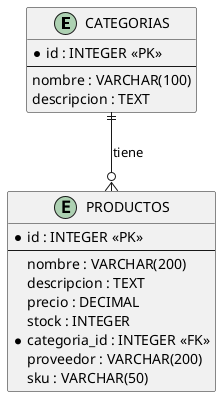

# Diagramas del Sistema de Inventarios

Este documento describe los diagramas que deben crearse para la documentación del proyecto.

## 📊 Diagramas Requeridos

### 1. Diagrama de Arquitectura General

**Herramienta recomendada**: [draw.io](https://app.diagrams.net/)

**Componentes a incluir**:

```
┌─────────────────────────────────────────────────────────┐
│                    CAPA PRESENTACIÓN                     │
│  ┌──────────────────────────────────────────────────┐  │
│  │  Frontend React + Vite (AWS Amplify/Netlify)    │  │
│  └────────────────────┬─────────────────────────────┘  │
└───────────────────────┼─────────────────────────────────┘
                        │
                        ▼
┌─────────────────────────────────────────────────────────┐
│                   CAPA MICROSERVICIOS                    │
│                    (EC2 + Docker Compose)                │
│                                                          │
│  ┌────────────┐  ┌────────────┐  ┌────────────┐       │
│  │ Productos  │  │  Órdenes   │  │Proveedores │       │
│  │  Service   │  │  Service   │  │  Service   │       │
│  │Python+Flask│  │Java+Spring │  │ Node+Expr  │       │
│  └─────┬──────┘  └─────┬──────┘  └─────┬──────┘       │
│        │               │               │               │
│  ┌─────▼──────┐  ┌─────▼──────┐  ┌─────▼──────┐      │
│  │   MySQL    │  │ PostgreSQL │  │  MongoDB   │      │
│  └────────────┘  └────────────┘  └────────────┘      │
│                                                        │
│  ┌────────────────┐     ┌────────────────┐           │
│  │  Integración   │     │   Analítico    │           │
│  │    Service     │     │    Service     │           │
│  │ Python+FastAPI │     │ Python+Athena  │           │
│  └────────────────┘     └────────┬───────┘           │
└────────────────────────────────────┼───────────────────┘
                                     │
                                     ▼
┌─────────────────────────────────────────────────────────┐
│                   CAPA DE DATOS (AWS)                    │
│                                                          │
│  ┌────────────┐         ┌────────────┐                 │
│  │  Ingesta   │────────►│ S3 Bucket  │                 │
│  │  (Docker)  │         │ Data Lake  │                 │
│  └────────────┘         └─────┬──────┘                 │
│                               │                         │
│                         ┌─────▼──────┐                 │
│                         │  AWS Glue  │                 │
│                         │  Catalog   │                 │
│                         └─────┬──────┘                 │
│                               │                         │
│                         ┌─────▼──────┐                 │
│                         │AWS Athena  │                 │
│                         │  Queries   │                 │
│                         └────────────┘                 │
└─────────────────────────────────────────────────────────┘
```

**Elementos clave**:

- Frontend en AWS Amplify
- 5 microservicios con sus tecnologías
- 3 bases de datos (MySQL, PostgreSQL, MongoDB)
- Sistema de ingesta
- S3 como Data Lake
- AWS Glue para catalogar
- AWS Athena para consultas
- Flechas indicando flujo de datos
- Load Balancer (opcional)

---

### 2. Diagrama E-R (Entidad-Relación)

**Modelo de Productos (MySQL)**:

```
┌─────────────────┐
│   CATEGORIAS    │
├─────────────────┤
│ PK id           │
│    nombre       │
│    descripcion  │
└────────┬────────┘
         │ 1
         │
         │ N
┌────────▼────────────────────┐
│       PRODUCTOS              │
├──────────────────────────────┤
│ PK id                        │
│    nombre                    │
│    descripcion               │
│    precio                    │
│    stock                     │
│ FK categoria_id  ───────────►│
│    proveedor                 │
│    sku                       │
│    fecha_creacion            │
│    fecha_actualizacion       │
└──────────────────────────────┘
```

**Modelo de Órdenes (PostgreSQL)**:

```
┌─────────────────┐
│    CLIENTES     │
├─────────────────┤
│ PK id           │
│    nombre       │
│    email        │
│    telefono     │
│    direccion    │
│    ciudad       │
│    pais         │
│    fecha_registro│
└────────┬────────┘
         │ 1
         │
         │ N
┌────────▼────────────┐
│      ORDENES        │
├─────────────────────┤
│ PK id               │
│    numero_orden     │
│ FK cliente_id       │
│    fecha_orden      │
│    estado           │
│    total            │
│    metodo_pago      │
│    direccion_envio  │
└────────┬────────────┘
         │ 1
         │
         │ N
┌────────▼────────────┐
│  DETALLES_ORDEN     │
├─────────────────────┤
│ PK id               │
│ FK orden_id         │
│    producto_id      │
│    nombre_producto  │
│    cantidad         │
│    precio_unitario  │
│    subtotal         │
└─────────────────────┘
```

**Modelo de Proveedores (MongoDB - Documento JSON)**:

```json
{
  "_id": ObjectId,
  "nombre": String,
  "ruc": String (unique),
  "email": String,
  "telefono": String,
  "direccion": {
    "calle": String,
    "ciudad": String,
    "estado": String,
    "pais": String,
    "codigoPostal": String
  },
  "contacto": {
    "nombre": String,
    "cargo": String,
    "telefono": String,
    "email": String
  },
  "categorias": [String],
  "calificacion": Number,
  "estado": String,
  "estadoEntrega": String,
  "condicionesPago": {
    "diasCredito": Number,
    "metodoPago": String
  },
  "estadisticas": {
    "totalOrdenes": Number,
    "ordenesCompletadas": Number,
    "ordenesPendientes": Number,
    "montoTotal": Number
  },
  "fechaRegistro": Date,
  "ultimaActualizacion": Date
}
```

---

### 3. Diagrama de Flujo de Datos (Ingesta)

```
┌──────────────┐
│ Microservicio│
│  Productos   │◄─────┐
└──────┬───────┘      │
       │              │
       │ REST API     │ Extracción
       │              │ periódica
       ▼              │
┌──────────────┐      │
│  Contenedor  │──────┘
│   Ingesta    │
│  Productos   │
└──────┬───────┘
       │
       │ CSV
       ▼
┌──────────────┐
│  S3 Bucket   │
│  /productos/ │
└──────┬───────┘
       │
       │ Catalogar
       ▼
┌──────────────┐
│  AWS Glue    │
│   Catalog    │
└──────┬───────┘
       │
       │ Consultar
       ▼
┌──────────────┐
│ AWS Athena   │
│   Queries    │
└──────────────┘
```

**Proceso similar para**: Órdenes, Clientes, Proveedores

---

### 4. Diagrama de Secuencia (Ejemplo: Crear Orden)

```
Usuario   Frontend   Integración   Productos   Órdenes
  │           │           │            │          │
  │  POST     │           │            │          │
  ├──────────►│           │            │          │
  │  Orden    │           │            │          │
  │           │  GET      │            │          │
  │           ├──────────►│            │          │
  │           │ Validar   │            │          │
  │           │ Producto  │   GET      │          │
  │           │           ├───────────►│          │
  │           │           │ Producto   │          │
  │           │           │◄───────────┤          │
  │           │           │            │          │
  │           │  POST     │            │          │
  │           ├──────────────────────────────────►│
  │           │  Crear    │            │          │
  │           │  Orden    │            │  Crear   │
  │           │           │            │  Orden   │
  │           │           │            │◄─────────┤
  │           │◄──────────────────────────────────┤
  │           │  Orden    │            │          │
  │◄──────────┤  Creada   │            │          │
  │  200 OK   │           │            │          │
```

---

## 🎨 Herramientas Recomendadas

### Para Diagramas de Arquitectura:

1. **[draw.io](https://app.diagrams.net/)** - Gratis, online, exporta PNG/PDF
2. **[Lucidchart](https://www.lucidchart.com/)** - Profesional
3. **[Excalidraw](https://excalidraw.com/)** - Estilo sketch

### Para Diagramas E-R:

1. **[dbdiagram.io](https://dbdiagram.io/)** - Específico para DB
2. **[draw.io](https://app.diagrams.net/)** - Plantillas de E-R
3. **MySQL Workbench** - Para ingeniería reversa

### Para Diagramas de Secuencia:

1. **[PlantUML](https://plantuml.com/)** - Código a diagrama
2. **[SequenceDiagram.org](https://sequencediagram.org/)** - Online
3. **[Mermaid](https://mermaid.live/)** - Markdown-like

---

## 📝 Instrucciones para Crear Diagramas

### Opción 1: Usar draw.io

```bash
# 1. Ir a https://app.diagrams.net/
# 2. Crear nuevo diagrama
# 3. Usar las plantillas incluidas en este documento
# 4. Exportar como PNG o PDF
# 5. Guardar en docs/diagrama-arquitectura.png
```

### Opción 2: Usar PlantUML (Recomendado para E-R)

```bash
# Instalar PlantUML
brew install plantuml  # macOS
# o
sudo apt install plantuml  # Linux

# Crear archivo .puml con el código del diagrama
# Generar PNG
plantuml diagrama-er.puml
```

**Ejemplo PlantUML para E-R**:



---

## 📂 Ubicación de Archivos

Guardar los diagramas en:

```
docs/
├── diagrama-arquitectura.png      # Arquitectura general
├── diagrama-arquitectura.pdf
├── diagrama-er-productos.png      # E-R de productos
├── diagrama-er-ordenes.png        # E-R de órdenes
├── diagrama-flujo-ingesta.png     # Flujo de ingesta
├── diagrama-secuencia.png         # Diagrama de secuencia
└── presentacion.pptx              # PowerPoint para exposición
```

---

## 🎯 Checklist de Diagramas

- [ ] Diagrama de arquitectura general en draw.io
- [ ] Diagrama E-R de Productos (MySQL)
- [ ] Diagrama E-R de Órdenes (PostgreSQL)
- [ ] Esquema de documento de Proveedores (MongoDB)
- [ ] Diagrama de flujo de ingesta a S3
- [ ] Diagrama de catálogo AWS Glue
- [ ] Capturas de pantalla de Athena
- [ ] Diagrama de despliegue en EC2
- [ ] PowerPoint de presentación

---

## 📊 Para la Presentación

### Slides Recomendados:

1. **Portada** - Título, integrantes, fecha
2. **Objetivo** - Qué hace el sistema
3. **Arquitectura** - Diagrama general
4. **Microservicios** - Explicar cada uno
5. **Base de Datos** - Diagramas E-R
6. **AWS Services** - S3, Glue, Athena
7. **Demo** - Capturas/video
8. **Resultados** - Métricas, consultas
9. **Conclusiones**
10. **Q&A**

---

## 💡 Tips

- Usa **colores consistentes** (ej: azul para servicios, verde para DB)
- Agrega **leyendas** explicando símbolos
- Incluye **tecnologías** en cada componente
- Muestra **flujo de datos** con flechas numeradas
- Exporta en **alta resolución** (300 DPI mínimo)
- Guarda versiones en **PNG y PDF**
